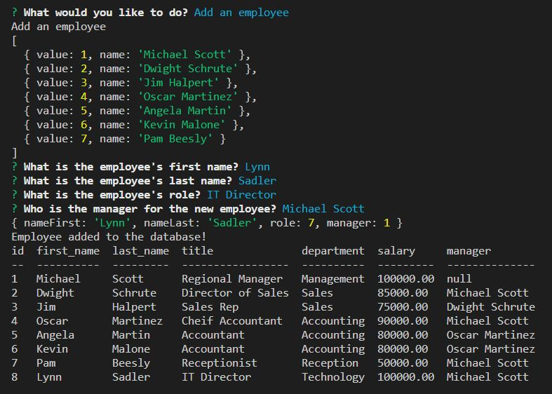

# Sadlers Employee Tracker

## Description
Sadler's Employee Tracker application can be used by businesses to view and manage the departments, roles, and employees in their company stored in a database. Using a content management systems (CMS) allows the business to view and interact with the database.  

## Access

The URL of the GitHub repository ...

https://github.com/lynnadelesadler/Sadlers-Employee-Tracker

The URL of the video walk through  ...

https://drive.google.com/file/d/14p5RQCjvf-tb-6IMQk6rD8fQ6jcDwcgZ/view

## Installation

- Install node.js if not already installed on your machine
- Open the project in Integrated Terminal. 
- Run the command `npm i` to install all node files.
- once complete run the command `node server.js` to connect to the database.

## Usage & Visuals
- WHEN the `node server.js` command is run in integrated terminal you are presented with the following options:

    - view all departments
    - view all roles
    - view all employees 
    - add a department
    - add a role
    - add an employee
    - update an employee role

- WHEN I choose to view all departments, THEN I am presented with a formatted table showing department names and department ids.

- WHEN I choose to view all roles, THEN I am presented with the job title, role id, the department that role belongs to, and the salary for that role.

- WHEN I choose to view all employees, THEN I am presented with a formatted table showing employee data, including employee ids, first names, last names, job titles, departments, salaries, and managers that the employees report to.

- WHEN I choose to add a department, THEN I am prompted to enter the name of the department and that department is added to the database.

- WHEN I choose to add a role, THEN I am prompted to enter the name, salary, and department for the role and that role is added to the database.

- WHEN I choose to add an employee, THEN I am prompted to enter the employee’s first name, last name, role, and manager, and that employee is added to the database.

- WHEN I choose to update an employee role, THEN I am prompted to select an employee to update and their new role and this information is updated in the database.

## Support
For help with this webpage please contact
|Name | Email |
|-----------|---------------------------|
|Lynn Sadler| lynnadelesadler@yahoo.com |

## Roadmap
Check back to this page as enhancements could be made for usability and optimized display.

## Authors and acknowledgment
Acknowledgment to  Node.js, Inquirer, and MySQL as this application runs off these applications.  

Coding credit to be given to Lynn Sadler for developing the application.

Acknowledgement to Uconn Full Stack Web Developer Bootcamp, Teachers and Teacher assistants for supporting me on my developer journey!

## License
N/A